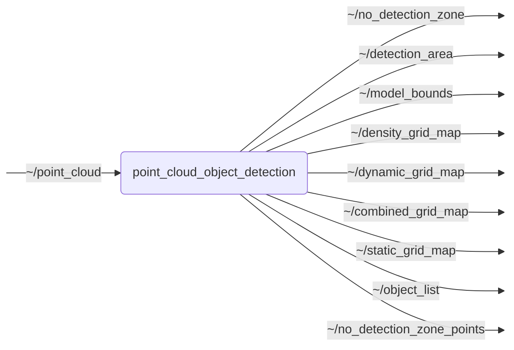

# `point_cloud_object_detection`

Provides a C++ ROS 2 node for point cloud object detection.

The node preprocesses point clouds, sends them to a [Triton Inference Server](https://github.com/triton-inference-server/server) via [triton_cpp](https://github.com/openads-project/triton_cpp), postprocesses the model outputs into bounding boxes, and publishes the detected objects using messages from [perception_interfaces](https://github.com/ika-rwth-aachen/perception_interfaces). The preprocessing and postprocessing implementations are shared through [pcod-common](https://github.com/openads-project/pcod-common), which can also be used in model-training pipelines.

The node can publish up to four grid maps as `nav_msgs/msg/OccupancyGrid` messages. The maps are derived from predicted density values (`d`) and occupancy values for dynamic objects (`o`):

- **Density grid map:** Represents above-ground point density and therefore provides evidence of obstacle occupancy (`d`).
- **Dynamic grid map:** Represents the model's estimate that a cell is occupied by a dynamic object (`o`).
- **Combined grid map:** Fuses the occupancy and density estimates as `o + 0.5 d (1 - o)`.
- **Static grid map:** Estimates static-obstacle occupancy by suppressing the density estimate in cells likely to contain dynamic objects: `d (1 - o)`.

Here, *dynamic objects* mean *objects capable of moving*, whether or not they are currently in motion. The dynamic grid output is intended to correspond to the model’s object detections but is trained separately.

## Nodes

### `point_cloud_object_detection`

ROS 2 node for point-cloud object detection. The node supports private topic names, launch-time remapping, and multiple instances with separate namespaces.

#### Subscribed Topics

| Topic | Type | Description |
| --- | --- | --- |
| `~/point_cloud` | `sensor_msgs/msg/PointCloud2` | input point cloud topic remap |

#### Published Topics

| Topic | Type | Description |
| --- | --- | --- |
| `~/no_detection_zone` | `geometry_msgs/msg/PolygonStamped` | no-detection zone polygon topic remap |
| `~/detection_area` | `geometry_msgs/msg/PolygonStamped` | detection area polygon topic remap |
| `~/model_bounds` | `geometry_msgs/msg/PolygonStamped` | model bounds polygon topic remap |
| `~/density_grid_map` | `nav_msgs/msg/OccupancyGrid` | density grid map topic remap |
| `~/dynamic_grid_map` | `nav_msgs/msg/OccupancyGrid` | dynamic grid map topic remap |
| `~/combined_grid_map` | `nav_msgs/msg/OccupancyGrid` | combined grid map topic remap |
| `~/static_grid_map` | `nav_msgs/msg/OccupancyGrid` | static grid map topic remap |
| `~/object_list` | `perception_msgs/msg/ObjectList` | output object list topic remap |
| `~/no_detection_zone_points` | `sensor_msgs/msg/PointCloud2` | no-detection zone points topic remap |

#### Parameters

| Parameter | Type | Default | Description |
| --- | --- | --- | --- |
| `preprocessing.backend` | `string` | `"cpu"` | Point preprocessing backend: 'cpu' or 'cuda'. If 'cuda' is selected, the node fails fast when CUDA preprocessing support is unavailable. |
| `prediction.server_url` | `string` | - | URL of the triton server, e.g. 134.130.20.221:8001 |
| `prediction.triton_client_timeout_s` | `float` | `2.0` | Client timeout for Triton requests in seconds (0.0 disables timeout) |
| `prediction.use_shm` | `bool` | `false` | Whether or not to use shared memory for Triton |
| `prediction.cuda_input_shm` | `bool` | `false` | If true, require Triton input tensors to use CUDA shared memory. This is only used when preprocessing.backend='cuda' and is independent of prediction.use_shm. If CUDA shared memory is unavailable, node startup fails. |
| `preprocessing.inference_frame` | `string` | - | Frame for inference |
| `output.frame` | `string` | - | Frame for object list |
| `output.sensor_id` | `int` | `0` | Sensor ID for object list |
| `output.variances` | `float[]` | `std::vector<double>(12, -1.0)` | Array with variances. Entries correspond to ISCACTR model defined in perception interfaces |
| `postprocessing.nms.iou_threshold` | `float` | - | NMS IoU threshold. Defaults to runtime_defaults.postprocessing.nms.iou_threshold from the model manifest. |
| `postprocessing.nms.max_num_objects` | `int` | - | Maximum number of objects after NMS. Defaults to runtime_defaults.postprocessing.nms.max_num_objects from the model manifest. |
| `input.point_feature_field` | `string` | `"intensity"` | Single-feature source: 'intensity' or 'reflectivity' |
| `preprocessing.point_feature.value_threshold` | `float` | `0.0F` | Point-feature value threshold. Defaults to runtime_defaults.preprocessing.point_feature.value_threshold from the model manifest. |
| `preprocessing.detection_area.z_min` | `float` | `0.0` | Effective preprocessing lower z-bound used for point filtering and tensor construction. Runtime override; defaults to the model manifest z range. Values outside the manifest z range are accepted with a warning. |
| `preprocessing.detection_area.z_max` | `float` | `0.0` | Effective preprocessing upper z-bound used for point filtering and tensor construction. Runtime override; defaults to the model manifest z range. Values outside the manifest z range are accepted with a warning. |
| `preprocessing.no_detection_zone.enabled` | `bool` | `false` | Enable rectangular no-detection zone in inference_frame |
| `preprocessing.no_detection_zone.remove_points` | `bool` | `false` | If true, remove raw points inside the no-detection zone from model input and unclassified point publishing |
| `preprocessing.no_detection_zone.x_min` | `float` | `0.0` | No-detection zone x_min (inference_frame) |
| `preprocessing.no_detection_zone.x_max` | `float` | `0.0` | No-detection zone x_max (inference_frame) |
| `preprocessing.no_detection_zone.y_min` | `float` | `0.0` | No-detection zone y_min (inference_frame) |
| `preprocessing.no_detection_zone.y_max` | `float` | `0.0` | No-detection zone y_max (inference_frame) |
| `preprocessing.no_detection_zone.publish_polygon` | `bool` | `false` | If true, publish a geometry_msgs/PolygonStamped with the no-detection zone bounds |
| `preprocessing.no_detection_zone.publish_points` | `bool` | `false` | If true, publish raw points inside the no-detection zone |
| `preprocessing.detection_area.enabled` | `bool` | `false` | Enable circular-sector detection area |
| `preprocessing.detection_area.center_x` | `float` | `0.0` | Detection area center x (m) in inference_frame |
| `preprocessing.detection_area.center_y` | `float` | `0.0` | Detection area center y (m) in inference_frame |
| `preprocessing.detection_area.radius` | `float` | `0.0` | Detection area radius (m) |
| `preprocessing.detection_area.bearing_deg` | `float` | `0.0` | Detection area central azimuth (deg, 0 along +x, CCW positive) |
| `preprocessing.detection_area.fov_deg` | `float` | `360.0` | Detection area FOV angle (deg) |
| `preprocessing.detection_area.publish_polygon` | `bool` | `false` | Publish geometry_msgs/PolygonStamped approximating the sector |
| `preprocessing.detection_area.num_segments` | `int` | `32` | Number of segments to approximate the circular arc (>= 3) |
| `preprocessing.detection_area.filter_detections` | `bool` | `false` | Remove detections outside the detection area |
| `preprocessing.detection_area.filter_mode` | `string` | `"center"` | Filtering mode: 'center' or 'complete' |
| `output.model_bounds.publish_polygon` | `bool` | `false` | Publish the model x/y range rectangle as geometry_msgs/PolygonStamped |
| `output.grid_maps.frame` | `string` | - | Frame for auxiliary grid-map publication. If empty, use the inference frame. |
| `output.grid_maps.publish_density` | `bool` | `false` | Publish decoded density logits as an auxiliary grid map |
| `output.grid_maps.publish_dynamic` | `bool` | `false` | Publish decoded dynamic-occupancy logits as an auxiliary grid map |
| `output.grid_maps.publish_combined` | `bool` | `false` | Publish a combined auxiliary occupancy grid map |
| `output.grid_maps.publish_static` | `bool` | `false` | Publish a static-obstacle occupancy grid map |
| `output.grid_maps.zero_in_no_detection_zone` | `bool` | `false` | If true, set published auxiliary grid-map cells inside the configured no-detection zone to zero |
| `output.grid_maps.zero_outside_detection_area` | `bool` | `false` | If true, set published auxiliary grid-map cells outside the configured detection area to zero |
| `output.grid_maps.density_gain` | `float` | `1.0` | Linear gain applied to the published density grid map |
| `output.grid_maps.dynamic_gain` | `float` | `1.0` | Linear gain applied to the published dynamic grid map |
| `output.grid_maps.combined_gain` | `float` | `1.0` | Linear gain applied to the published combined grid map |
| `output.grid_maps.static_gain` | `float` | `1.0` | Linear gain applied to the published static grid map |

## Launch Files

### [`point_cloud_object_detection.launch.py`](launch/point_cloud_object_detection.launch.py)

| Argument | Default | Description |
| --- | --- | --- |
| `point_cloud_topic` | `"~/point_cloud"` | input point cloud topic remap |
| `object_list_topic` | `"~/object_list"` | output object list topic remap |
| `no_detection_zone_topic` | `"~/no_detection_zone"` | no-detection zone polygon topic remap |
| `no_detection_zone_points_topic` | `"~/no_detection_zone_points"` | no-detection zone points topic remap |
| `detection_area_topic` | `"~/detection_area"` | detection area polygon topic remap |
| `model_bounds_topic` | `"~/model_bounds"` | model bounds polygon topic remap |
| `density_grid_map_topic` | `"~/density_grid_map"` | density grid map topic remap |
| `dynamic_grid_map_topic` | `"~/dynamic_grid_map"` | dynamic grid map topic remap |
| `combined_grid_map_topic` | `"~/combined_grid_map"` | combined grid map topic remap |
| `static_grid_map_topic` | `"~/static_grid_map"` | static grid map topic remap |
| `name` | `"point_cloud_object_detection"` | node name |
| `namespace` | `""` | node namespace |
| `params` | `os.path.join(get_package_share_directory("point_cloud_object_detection"), "config", "params.yml")` | path to parameter file |
| `log_level` | `"info"` | ROS logging level (debug, info, warn, error, fatal) |
| `use_sim_time` | `"false"` | use simulation clock |
| `ros_tracing` | `"false"` | Enable tracing |
